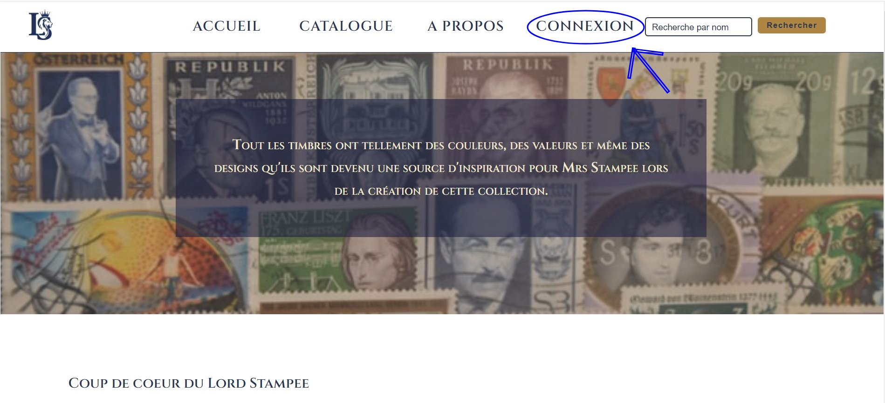
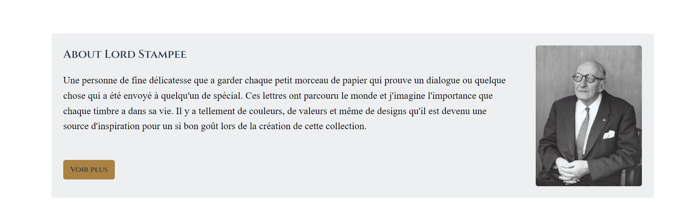
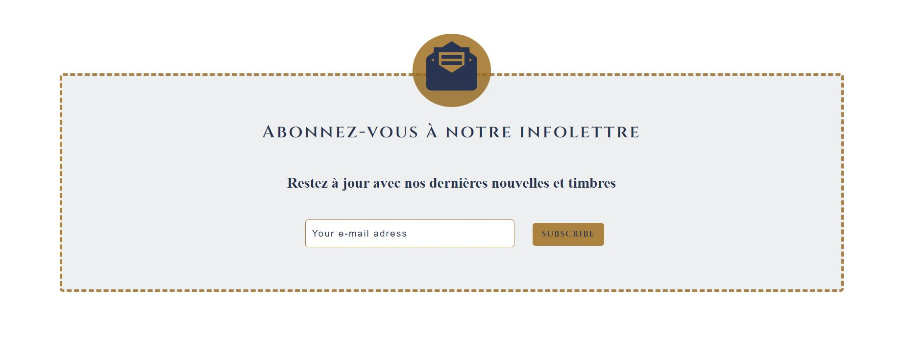
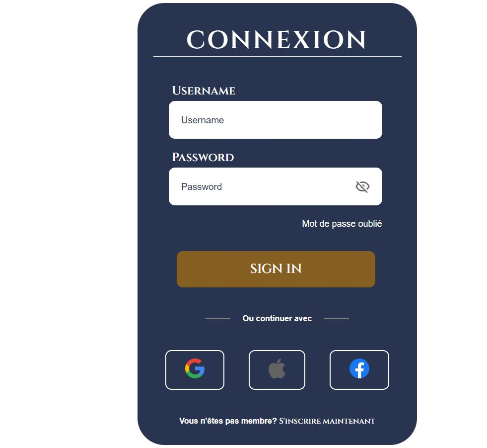
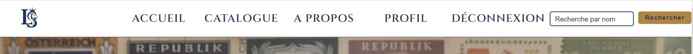
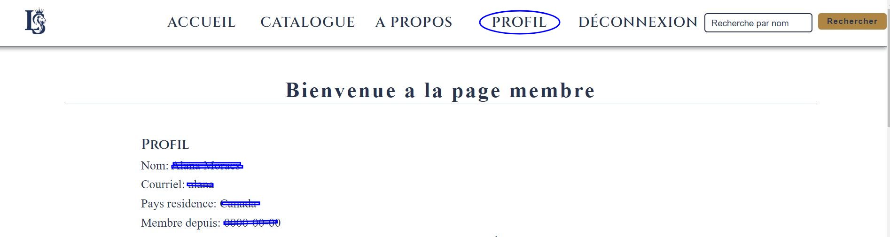
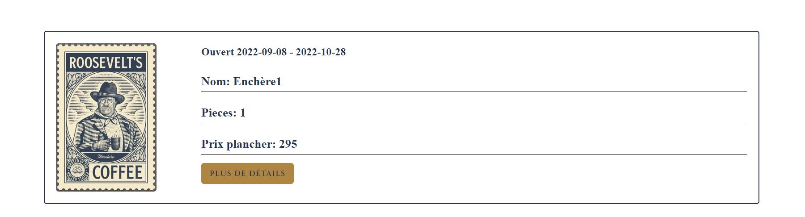
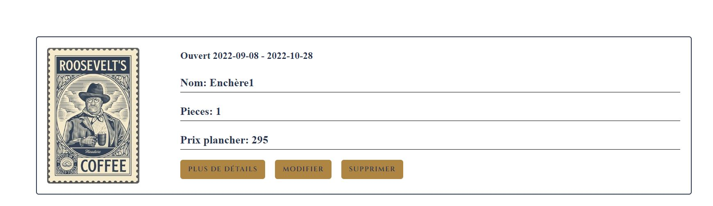
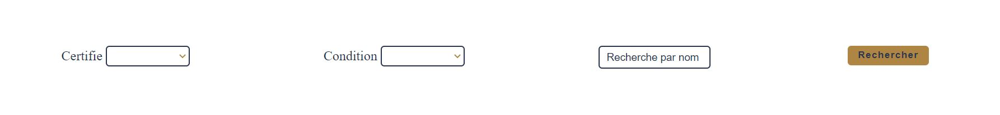
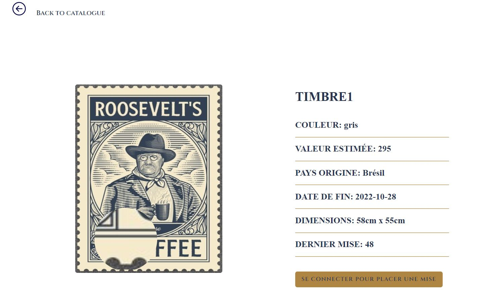

# Bienvenue au guide d'utilisateur du site Stampee

## URL
  http://stampee.localhost/accueil/index

## Accueil

- Menu navigation en haut

- Accés aux timbres par pays
  

- Accés ao profil du Lord Stampee

- Accés a notre infolettre

## Se connecter
    - Aller sur le menu navigation et cliquez sur connexion pour se connecter.
  

    - Si vous êtes déjà membre, entrez votre courriel et votre mot de passe.
  

    - Sinon cliquez sur s'inscrire maintenant.

## Membre

- Une fois connecté, le menu de navigation en haut ouvrira une autre fonction appelée : PROFIL.

- Si vous entrez dans le PROFIL vous allez trouvez l'endroit où seront stockés tous vos timbres préférés, les timbres que vous avez créés et vous donneront la possibilité d'insérer un nouveau timbre.

## Catalogue

- Dans le menu de navigation, si vous cliquez sur catalogue, vous aurez accès à tous les encheres actuellement disponibles. Ou vous pouvez cliquer directement sur l'accueil dans les images ci-dessous.

- Si vous n'êtes pas connecté, vous aurez accès à tous les enchères et timbres mais vous ne pourrez pas changer et n'aurez pas accès à modifier et supprimer les timbres que vous avez créés.

- Si vous êtes connecté, les timbres créés uniquement par vous apparaîtront disponibles pour modification et suppression.

- Également dans le catalogue, vous pouvez filtrer par condition de timbre, s'il est certifié ou non et par nom de timbre. Pour cela vous devez sélectionner ce que vous souhaitez filtrer et cliquer sur le bouton rechercher.

- En cliquant sur le bouton plus de détails vous aurez accès aux timbres liés à ce enchère et vous pourrez zoomer pour voir plus de détails sur les timbres, plus d'informations à son sujet et si vous êtes connecté vous pourrez faire une mise.

